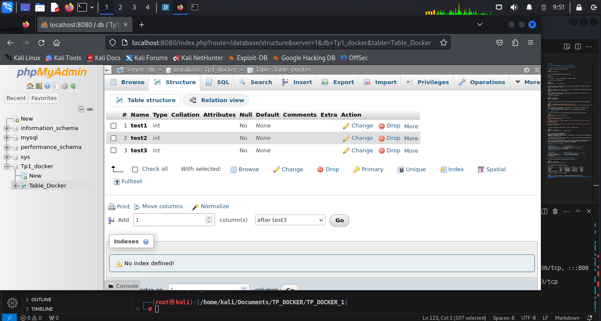

# TP1 DOCKER

## 2 . Dans un repo GIT&GithuB, créez un dossier TP_DOCKER_1

## 3 . Executer un serveur web (apache) dans un container docker

a. Récuperer l'image sur le docker hub (httpd)

```bash
docker pull httpd:latest
```

b. Vérifier que vous disposez bien de l'image en local

```bash
docker images
```
- Res: httpd        latest    2776f4da9d55   5 weeks ago   167MB

c. Créer un fichier ./html/index.html

```bash
mkdir ./html
echo "Hello World" > ./html/index.html
```

d. Démarrer un nouveau container et servir la page html créée précédemment à l'aide d'une référence absolue (chemin de racine à racine):

```bash
docker run -dp 8080:80 --name contenair_index.html -v D:\Git\TP_DOCKER\TP_DOCKER_1\html\index.html:/usr/local/apache2/htdocs/index.html  httpd:latest
docker ps
```
- Res : e2647ed9fff8   httpd:latest   "httpd-foreground"   10 seconds ago   Up 3 seconds   0.0.0.0:8080->80/tcp   contenair_index.html

e. Supprimer le container

```bash
docker stop 9066bf6d3105
docker rm 9066bf6d3105
```

f. Relancez le même container sans l'option -v puis cp pour servir votre fichier (docker cp ARGS)

```bash
docker run -dp 8080:80 --name contenair_via_cp httpd:latest
docker cp D:\Git\TP_DOCKER\TP_DOCKER_1\html\index.html 12f01eb59afc:/usr/local/apache2/htdocs/index.html
docker ps
```
- Res : 12f01eb59afc   httpd:latest   "httpd-foreground"   9 seconds ago   Up 3 seconds   0.0.0.0:8080->80/tcp   contenair_via_cp <br>
        Successfully copied 2.05kB to 12f01eb59afc:/usr/local/apache2/htdocs/index.html

## 4 . Builder une image

a. A l'aide d'un Dockerfile, créer une image qui permet d'exécuter un serveur web (apache)

```bash
echo "# Récupérer l'image Apache officielle.
FROM httpd:latest

# Nous place dans le dossier de travail du container.
WORKDIR /usr/local/apache2/htdocs/

# Copie le fichier index.html depuis TP_DOCKER_1 en local vers le dossier de travail du container précédemment définie.
COPY ./html/index.html .

# Mappe le port 80 sur Docker pour qu'il soit accessible depuis l'extérieur sur le port de l'hôte.
EXPOSE 80" > ./Dockerfile
```

b. Exécuter cette nouvelle image de manière à servir ./html/index.html

```bash
docker build -t imagehtml .
docker run --name containerhtml -d -p 8080:80 imagehtml
```

- Res : Successfully built 106b2ee870eb <br>
Successfully tagged imagehtml:latest <br>
e0be629cfa71   imagehtml   "httpd-foreground"   16 seconds ago   Up 15 seconds   0.0.0.0:8080->80/tcp, :::8080->80/tcp   containerhtml

c. Les différences observées entre les questions 3 et 4, trouvez les avantages et les inconvénients de chaque procédure (mount volume vs copy).

- Res : Via une commande CMD (question 3), la construction est rapide mais la reproductibilité et la gestion d'équipe sont limitées. Avec un Dockerfile, la reproductibilité est assurée, mais la construction peut être plus lente et l'image peut être volumineuse.

### Montage de Volumes (Volume Mount) :

| **Avantages**                     | **Inconvénients**                             |
|-----------------------------------|-----------------------------------------------|
| Persistance des données           | Complexité initiale                           |
| Facilité de mise à jour des fichiers | Dépendance au système de fichiers hôte       |
| Partage de données entre plusieurs conteneurs |                                           |

### Copie de Fichiers (COPY) :

| **Avantages**                     | **Inconvénients**                             |
|-----------------------------------|-----------------------------------------------|
| Facilité d'utilisation             | Pas de persistance des données               |
| Indépendance du système hôte        | Taille de l'image peut augmenter              |
| Reproductibilité                   |                                               |

## 5 . Utiliser une base de données dans un contenair docker

a. Récupérer les images mysql et phpmyadmin depuis le Docker Hub

```bash
docker pull mysql:latest
docker pull phpmyadmin/phpmyadmin:latest
```

- Res : Images Docker actuellement présentes :

| Repository              | Tag       | Image ID       | Created          | Size  |
|-------------------------|-----------|-----------------|------------------|-------|
| imagehtml               | latest    | 106b2ee870eb   | 52 minutes ago   | 167MB |
| mysql                   | latest    | a88c3e85e887   | 4 weeks ago      | 632MB |
| httpd                   | latest    | 2776f4da9d55   | 5 weeks ago      | 167MB |
| phpmyadmin/phpmyadmin   | latest    | 933569f3a9f6   | 7 months ago     | 562MB |

b. Exécuter 2 containers à partir des images

```bash
docker run -d --name mysql_container -e MYSQL_ROOT_PASSWORD=password mysql:latest
docker run -d --name phpmyadmin_container --link mysql_container:db -p 8080:80 phpmyadmin/phpmyadmin:latest
```

- Res : Pour vérifier que la connexion à la plateforme phpmyadmin est possible, localhost:8080



## 6 . Utilisation de docker-compose.yml

a. Décrire à quoi sert docker-compose par rapport à docker run

### Comparaison entre Docker Compose et Docker Run :

| Caractéristique                             | Docker Compose                                              | Docker Run                                            |
|--------------------------------------------|-------------------------------------------------------------|-------------------------------------------------------|
| Utilisation                                 | Définir et gérer des applications multi-conteneurs           | Lancer des conteneurs Docker individuels               |
| Facilité de configuration                   | Facilite la configuration                                    | Principalement utilisé pour des cas simples ou des tests rapides  |
| Gestion des applications complexes         | Permet de définir plusieurs services, leurs dépendances et configurations dans un fichier unique | Difficile pour la gestion d'applications complexes ou multi-conteneurs  |

b. Les commandes qui permet de lancer et stopper tout les contenairs du fichiers yaml

```bash
docker-compose up 
docker-compose down
```
