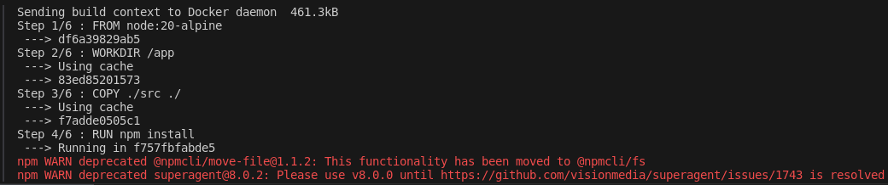

# TP2 DOCKER

## 1 . Récupérer le code source du TP et le mettre dans TP_DOCKER_2

## 2 . Créer un Dockerfile qui permet de lancer une application NodeJS (v20-alpine)

```Dockerfile
FROM node:20-alpine
WORKDIR /app

COPY ./src ./
RUN npm install

CMD ["node","server.js"]
EXPOSE 3000
```

```Bash
docker build -t node_docker .
docker run -dp 3000:3000 node_docker
```

## 3 . Utilisez docker pour lancer une image de base de données (mysql)

- Res : Le build de l'image Node a un temps de construction de plus de 4 heures. Je ne peux donc pas continuer le TP2. Je suis donc les différentes étapes avec mon groupe avant de débuter sur le projet final.

